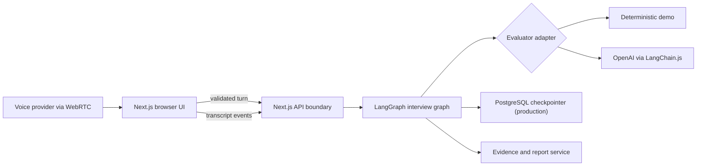
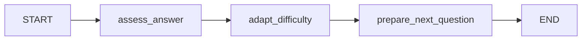

# Architecture

## System shape

Interview Coach uses one TypeScript contract from browser to graph to report.
Provider-specific behavior sits behind evaluator and voice adapters.



## Monorepo boundaries

- `apps/web`: UI, HTTP boundary, provider-key forwarding, security headers.
- `packages/contracts`: stable Zod schemas and inferred TypeScript types.
- `packages/interview-engine`: graph, scorer adapters, difficulty logic, reports.
- Future `packages/database`: schema, tenant-scoped repositories, migrations.
- Future `packages/evaluation`: datasets, rubric graders, calibration reports.
- Future `packages/voice`: ephemeral credentials and provider-neutral events.

## Interview graph

The alpha graph is intentionally small:



Production adds load/persist nodes, interruption policy, time budgets, coverage
planning, and a final report branch. Nodes return partial state updates. Graph
state must never contain provider API keys.

## Persistence

The alpha passes the complete transcript state with each turn and is stateless
on the server. Production must:

- compile the graph with `PostgresSaver`;
- use the stable interview session ID as LangGraph `thread_id`;
- store transcript/evidence in tenant-scoped relational tables;
- use an idempotency key per candidate turn;
- store runtime provider keys outside checkpoints;
- support explicit deletion across product and checkpoint tables.

`MemorySaver` is acceptable only in tests and local experiments.

## Provider key boundary

The browser key mode is convenient, not zero-trust: a hosted backend forwarding
a key can technically observe it. The UI must say this plainly.

Preferred trust order:

1. local self-host with server-managed secret;
2. provider ephemeral token minted by the self-hosted backend;
3. tab-scoped key forwarded over TLS and discarded;
4. never: query string, analytics property, log field, checkpoint, or database.

## Voice

The browser speech-recognition feature in alpha is progressive enhancement, not
the production voice architecture. Production voice uses WebRTC and normalized
events:

```ts
type VoiceEvent =
  | { type: "speech.started"; atMs: number }
  | { type: "transcript.partial"; text: string; sequence: number }
  | { type: "transcript.final"; text: string; sequence: number }
  | { type: "interviewer.audio.delta"; audio: ArrayBuffer }
  | { type: "interruption.requested"; reason: string }
  | { type: "error"; code: string; recoverable: boolean };
```

Audio should travel directly between browser and provider when possible. The
backend owns authorization, ephemeral-token minting, interview state, and event
audit—not the media plane.

## Security controls

- Shared Zod validation at browser/API/graph boundaries.
- Server-only provider and database secrets.
- Security headers and a restrictive CSP.
- `Cache-Control: no-store` on assessment responses.
- Error logging by error class, never raw provider response or request headers.
- Bounded LangGraph recursion and provider retries.
- Rate limiting, authentication, origin validation, CSRF, and tenant guards are
  required before hosted production.

## Testing strategy

- Unit: deterministic scorer and difficulty boundary tests.
- Contract: every provider returns the same validated schema.
- Graph: state transition and retry fixtures.
- API: invalid input, missing key, idempotency, redaction.
- Browser: setup, five-turn interview, report, keyboard-only, reduced motion.
- Evaluation: golden transcript dataset scored against calibrated human labels.
- Operations: load, provider outage, database failover, backup/restore, deletion.

## Container runtime

The current alpha is packaged as one Next.js standalone container because it
has no required database or queue. `compose.yaml` is the canonical local
orchestration entry point.

Runtime controls:

- non-root `nextjs` user;
- read-only root filesystem and memory-backed `/tmp`;
- all Linux capabilities dropped;
- `no-new-privileges`;
- application and Docker health checks at `/api/health`;
- provider credentials injected only through runtime environment variables.

When durable sessions are implemented, PostgreSQL will become a second Compose
service for local development. Production deployments should use a managed
PostgreSQL service and keep database credentials outside the image.
