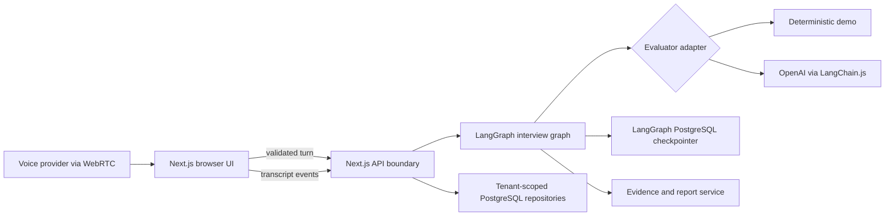
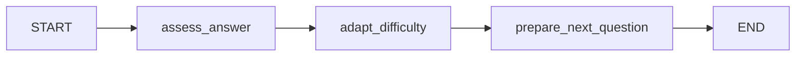

# Architecture

## System shape

Interview Coach uses one TypeScript contract from browser to graph to report.
Provider-specific behavior sits behind evaluator and voice adapters.



## Monorepo boundaries

- `apps/web`: UI, HTTP boundary, provider-key forwarding, security headers.
- `packages/contracts`: stable Zod schemas and inferred TypeScript types.
- `packages/database`: SQL migrations, tenant-scoped repositories, encrypted
  provider connections, and the LangGraph checkpointer.
- `packages/interview-engine`: graph, scorer adapters, difficulty logic, reports.
- `evaluation`: public deterministic fixtures and expected score bounds.
- Future `packages/voice`: ephemeral credentials and provider-neutral events.

## Interview graph

The alpha graph is intentionally small:



The durable alpha compiles this graph with `PostgresSaver`; repository writes
remain explicit around the graph so authorization, idempotency, export, and
deletion are independently testable. Future voice work adds interruption
policy, time budgets, and coverage planning. Nodes return partial state updates.
Graph state never contains provider API keys.

## Persistence

The durable path:

- compiles the graph with `PostgresSaver`;
- uses the stable interview session ID as LangGraph `thread_id`;
- stores transcript and evidence in tenant- and user-scoped relational tables;
- reserves an idempotency key before evaluating every candidate turn;
- persists the validated response with an optimistic session-version check;
- stores runtime provider keys outside checkpoints;
- deletes both product rows and LangGraph checkpoint rows on user request.

`MemorySaver` is acceptable only in tests and local experiments.

The legacy stateless API remains available when `DATABASE_URL` is absent, so
contributors can still run the keyless demo without PostgreSQL.

## Identity and request integrity

The durable alpha creates a private guest tenant and user behind a random opaque
cookie. Only a SHA-256 digest is stored in PostgreSQL. The cookie is `HttpOnly`,
`SameSite=Lax`, and secure in production. Every repository query scopes by both
tenant and user. Mutation routes require same-origin requests and the
`x-interview-coach-client` header.

This is durable pseudonymous identity, not a complete account system. Registered
accounts, recovery, organization membership, and an external identity provider
remain future work.

## Provider key boundary

The browser key mode is convenient, not zero-trust: a hosted backend forwarding
a key can technically observe it. The UI must say this plainly.

Preferred trust order:

1. local self-host with a server environment secret;
2. explicitly opted-in per-user secret encrypted with AES-256-GCM;
3. provider ephemeral token minted by the self-hosted backend;
4. tab-scoped key forwarded over TLS and discarded;
5. never: query string, analytics property, log field, or checkpoint.

Encrypted storage requires a 32-byte operator-managed
`PROVIDER_ENCRYPTION_KEY`. The database stores ciphertext, nonce, authentication
tag, and key version; list APIs expose metadata only.

## Voice

The browser speech-recognition feature in alpha is progressive enhancement, not
the production voice architecture. Production voice uses WebRTC and normalized
events:

```ts
type VoiceEvent =
  | { type: "speech.started"; atMs: number }
  | { type: "transcript.partial"; text: string; sequence: number }
  | { type: "transcript.final"; text: string; sequence: number }
  | { type: "interviewer.audio.delta"; audio: ArrayBuffer }
  | { type: "interruption.requested"; reason: string }
  | { type: "error"; code: string; recoverable: boolean };
```

Audio should travel directly between browser and provider when possible. The
backend owns authorization, ephemeral-token minting, interview state, and event
audit—not the media plane.

## Security controls

- Shared Zod validation at browser/API/graph boundaries.
- Server-only provider and database secrets.
- Security headers and a restrictive CSP.
- `Cache-Control: no-store` on assessment responses.
- Error logging by error class, never raw provider response or request headers.
- Bounded LangGraph recursion and provider retries.
- Opaque guest authentication, origin validation, CSRF defense, and tenant
  guards on durable objects.
- Rate limiting and an external identity provider remain required before a
  general internet-facing hosted service.

## Testing strategy

- Unit: deterministic scorer and difficulty boundary tests.
- Contract: every provider returns the same validated schema.
- Graph: state transition and retry fixtures.
- API: invalid input, missing key, idempotency, redaction.
- Browser: setup, five-turn interview, report, keyboard-only, reduced motion.
- Evaluation: public fixtures today; calibrated human labels before public v1.
- Operations: load, provider outage, database failover, backup/restore, deletion.

## Container runtime

`compose.yaml` is the canonical local orchestration entry point. It starts:

1. pinned PostgreSQL with a persistent named volume;
2. a one-shot migration image that also installs LangGraph checkpoint tables;
3. the Next.js standalone web image after migrations succeed.

Runtime controls:

- non-root `nextjs` user;
- read-only root filesystem and memory-backed `/tmp`;
- all Linux capabilities dropped;
- `no-new-privileges`;
- application and Docker health checks at `/api/health`;
- provider credentials injected only through runtime environment variables.
- database-aware liveness at `/api/health`.

Production deployments should use a managed PostgreSQL service, TLS, a secret
manager, rate limiting, backup/restore procedures, and monitored migration
rollouts.
