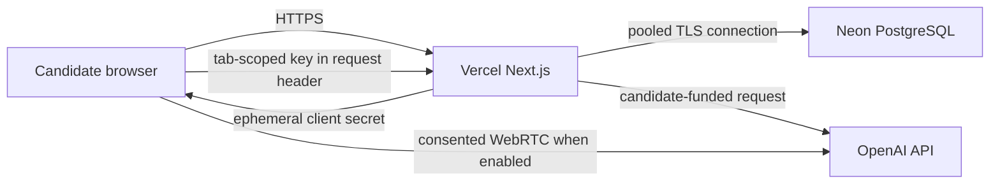

# Hosted BYOK Alpha Plan

## Outcome

Publish a public, non-commercial alpha that lets candidates:

- run the deterministic demo without an API key;
- run OpenAI-backed text interviews with a key kept in the current browser tab;
- resume, export, and delete pseudonymous interview sessions;
- see clear alpha, privacy, cost, and responsible-use boundaries;
- self-host the complete application with one Docker command.

The hosted alpha is a coaching reference implementation. It is not a hiring
decision system, a validated pronunciation assessor, or the public-v1 release
defined in the PRD.

## Hosting decision

### Recommended now: Vercel plus Neon PostgreSQL

Use Vercel for the existing Next.js Node runtime and Neon for PostgreSQL.

Reasons:

- the application already targets the full Node.js runtime, Next.js route
  handlers, `pg`, and the LangGraph PostgreSQL checkpointer;
- Vercel can deploy the pnpm/Turborepo monorepo without a runtime adapter;
- Vercel Functions stop consuming CPU and memory between requests;
- the Vercel Hobby plan has a zero-dollar starting point and hard usage caps,
  which avoids automatic overage charges for a personal, non-commercial alpha;
- Neon PostgreSQL scales compute to zero when idle and preserves the existing
  schema, transactions, and checkpoint implementation;
- the provider bill stays with the candidate because no operator-funded model
  key is configured.

Vercel Hobby is limited to personal, non-commercial use. Before monetization,
team use, or a commercial offering, move to an appropriate paid plan and
re-approve the operating budget.

Current platform references:

- [Vercel pricing](https://vercel.com/pricing)
- [Vercel Fluid Compute pricing](https://vercel.com/docs/functions/usage-and-pricing)
- [Vercel monorepos](https://vercel.com/docs/monorepos)
- [Neon pricing](https://neon.com/pricing)
- [Neon scale to zero](https://neon.com/docs/introduction/scale-to-zero)

### Cloudflare option

Cloudflare Workers can deploy Next.js through the OpenNext adapter, and
Hyperdrive supports the `pg` driver. It is not the first deployment target for
this repository because the current global PostgreSQL pool and global
`PostgresSaver` reuse connections across requests. Workers explicitly requires
request-scoped database clients, so this path needs a database lifecycle
refactor and a second runtime test matrix.

Workers Free also allows only 10 ms CPU per request. Cloudflare documents that
SSR and authentication workloads commonly use 10-20 ms, so the free plan is an
unsafe reliability assumption for this application. Workers Paid has a USD 5
monthly minimum before usage overages.

Revisit Cloudflare when either edge placement is a measured requirement or the
team accepts the adapter work and paid-plan floor.

Current platform references:

- [Next.js on Cloudflare Workers](https://developers.cloudflare.com/workers/framework-guides/web-apps/nextjs/)
- [Workers limits](https://developers.cloudflare.com/workers/platform/limits/)
- [Workers pricing](https://developers.cloudflare.com/workers/platform/pricing/)
- [Hyperdrive PostgreSQL support](https://developers.cloudflare.com/hyperdrive/examples/connect-to-postgres/)

## Hosted-alpha architecture



Trust and cost boundaries:

- do not configure an operator OpenAI or Anthropic key;
- do not enable saved provider connections for the first hosted alpha;
- keep the candidate key in browser memory for the current tab and forward it
  only to the selected provider route;
- never include keys in URLs, logs, traces, checkpoints, exports, or analytics;
- send raw voice audio directly between the browser and provider over WebRTC;
- retain transcripts and reports only for the documented alpha window;
- keep deterministic demo mode available when a provider is unavailable.

## Implementation plan

### Phase 0 - decisions and repository hygiene

- [x] Select Apache-2.0 and add `LICENSE`, including the explicit patent grant.
- [ ] Confirm that the hosted alpha is personal and non-commercial while it is
      on Vercel Hobby.
- [ ] Confirm the public hostname and data region. Recommended hostname:
      `interview-coach.vinodspattar.in`; recommended function region: Mumbai.
- [ ] Remove or reconcile local untracked duplicate files ending in ` 2` after
      their origin is confirmed. They must never be bulk-staged.

Exit gate: the license, intended use, hostname, and region are explicit.

### Phase 1 - Vercel and Neon deployment foundation

- [x] Create the Vercel project with the monorepo web application configured.
- [x] Provision a Neon Free project in the same practical geography as the
      Vercel function and use its pooled TLS connection string.
- [ ] Add production environment validation for `DATABASE_URL`, `APP_ORIGIN`,
      `SESSION_COOKIE_SECURE`, `APP_VERSION`, and voice model identifiers.
- [ ] Keep `PROVIDER_ENCRYPTION_KEY`, `OPENAI_API_KEY`, `ANTHROPIC_API_KEY`, and
      `LANGSMITH_API_KEY` unset in the initial hosted alpha.
- [x] Run idempotent migrations as a gated deployment step, never from request
      startup.
- [ ] Add a preview deployment workflow, migration check, and production
      promotion only after CI and smoke tests pass.
- [x] Verify `/api/health` reports the deployed revision and database health
      without exposing connection details.

Exit gate: a private preview survives a cold start and database scale-to-zero,
and migrations can be repeated safely.

### Phase 2 - public BYOK safety and cost controls

- [ ] Add a first-run disclosure explaining that the hosted backend forwards
      the tab-scoped key and that local self-hosting is the stronger trust mode.
- [ ] Add a provider-key connection test that returns only a redacted result.
- [ ] Add one Vercel WAF rate-limit rule for mutation and provider-token routes.
- [x] Add per-guest and registered daily session/turn budgets enforced in
      PostgreSQL, with minute-level throttles.
- [x] Enforce request-size limits for every JSON mutation route.
- [ ] Add regression tests proving keys never enter logs, audit metadata,
      LangGraph state, exports, or persisted session records.
- [x] Disable encrypted saved connections in the UI when server-side encryption
      is not configured.
- [x] Add a daily, authenticated retention job. Vercel Hobby supports daily
      cron execution; the job must delete expired sessions, turns, reports,
      grants, audit metadata, and LangGraph checkpoints in bounded batches.
- [ ] Document a hard usage cap and alert thresholds for Vercel and Neon.

Exit gate: abuse cannot spend an operator model budget, retained data expires,
and the deployment stops or degrades safely at platform limits.

### Phase 3 - hosted product acceptance

- [ ] Run the complete deterministic five-turn journey on the preview URL.
- [ ] Run a real BYOK OpenAI text interview and verify key disposal.
- [ ] Verify session resume, concurrent-tab conflict handling, export, report
      regeneration, and complete deletion after a cold start.
- [ ] Validate the text path in current Chrome, Firefox, Safari, and mobile
      Safari/Chrome.
- [ ] Keep live voice labelled experimental until real Chrome, Safari, device,
      network, reconnect, transcript-error, and latency evidence is recorded.
- [ ] Complete keyboard, 200% zoom, contrast, reduced-motion, and screen-reader
      checks for setup, interview, report, export, and delete.
- [ ] Verify CSP, secure cookies, same-origin mutation protection, TLS, WAF,
      secret redaction, and tenant isolation against the hosted URL.

Exit gate: the public text experience is usable and reversible, while every
unvalidated voice or hiring-quality claim remains visibly qualified.

### Phase 4 - launch and operations

- [x] Promote the CI-tested main revision to production.
- [ ] Attach the custom domain and verify DNS, TLS, redirects, and `APP_ORIGIN`.
- [ ] Add content-free runtime metrics for starts, completions, provider
      failures, latency, retries, fallback, export, deletion, and estimated
      candidate-funded token usage.
- [ ] Create incident, provider outage, key exposure, deletion failure, backup,
      and restore runbooks.
- [ ] Verify a Neon restore and a clean redeploy before announcing availability.
- [x] Update the project website and README with the live app URL, current
      limitations, privacy window, and self-host instructions.

Exit gate: production smoke tests pass, rollback is rehearsed, and monitoring
can distinguish platform, database, provider, and application failures.

### Phase 5 - public v1 after the alpha is stable

- [ ] Add a second hosted evaluator and one local evaluator adapter.
- [ ] Run the qualified-human calibration and score-stability study.
- [ ] Finish circuit breaking plus stream/database failure injection.
- [ ] Publish durable cost, latency, completion, and fallback reports.
- [ ] Complete independent WCAG 2.2 AA and security reviews.
- [ ] Validate load, backup, restore, failover, and retention evidence.
- [ ] Publish the final model/rubric card and calibrated role packs.
- [x] Add optional pseudonymous accounts with one-time recovery material,
      rotation, sign-out, and complete account deletion; guest mode remains
      useful for low-friction practice. Verified external identity remains a
      separate future decision.

Exit gate: all public-v1 gates in the PRD and production-readiness checklist
are satisfied with current measured evidence.

## Local developer experience

The repository already has the required one-command full-stack path:

```bash
docker compose up --build --detach --wait
```

It starts PostgreSQL, applies migrations, starts the production Next.js image,
and waits for database-backed health. Keep this path provider-free by default.

For rapid UI and engine work, keep the existing Node path:

```bash
corepack enable
pnpm install
pnpm dev
```

Local acceptance requirements:

- the deterministic demo works with no secrets;
- `.env.example` remains sufficient and contains no real credentials;
- Docker and native Node paths use the same migrations and contracts;
- Cloud-host-specific bindings never become mandatory for local execution;
- `pnpm check` and `pnpm test:e2e` remain the pre-push verification gates.

## Launch boundary

The first hosted release may be called **public hosted alpha** only after
Phases 0-4 pass. It must not be called production-ready, hiring-grade,
pronunciation-aware, calibrated, fair across populations, or voice-reliable
until the separate public-v1 evidence exists.
